# Task Master

## Purpose
This project was actually an idea from a bootcamp project. During the bootcamp a team and myself created the original pokedex. The functonality was very basic. A user could add up to six pokemon to their pokedex. The idea was to implement basic CRUD operations and practice writting the various routes. While I worked very hard on the original I knew it could have been way cooler than just adding six pokemon and being done. I had always planned on coming back and implementing more features to the pokedex. So I started from scratch and completely rebuilt it. This time I added methods that prevented a user from adding certain types of pokemon without enough experience. A user can gain experience by taking quizes and gainging levels. Overall Im very proud of how it turned out. 

## Process
The basic logic of the site was the first thing that needed to be done. Once I built my database and its models I started to build up html and api routes. Once the basic routes were built I started to build and style the html. Once I had a skeleton built I contined to work on the functionality. The process involved alot of messing around with the pokeAPI and determining what info I wanted to use and how to navigate to it. The project had several variations and after playing around I settled on what information to present. Other than that it was just using basic design principles I have been stufying and styling the page. Over all this is a huge differnce from the original project which I will link below. 

## Languages 
JavaScript 
 
HTML 
 
CSS 

## Links
[GitHub](https://github.com/sharkattack182/pokedex2.0)
 
[Deployed](https://pokedex-part-deux.herokuapp.com/)
 
[Previous Version](https://vast-escarpment-44555.herokuapp.com/)
 

## Visuals

### Mobile
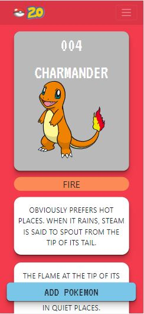
 
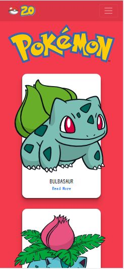
 
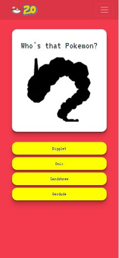
 
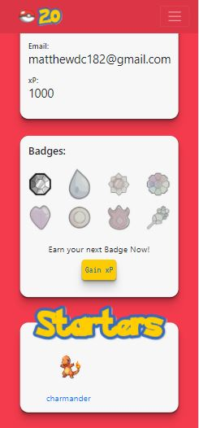
 
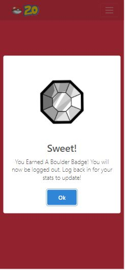

### Ipad
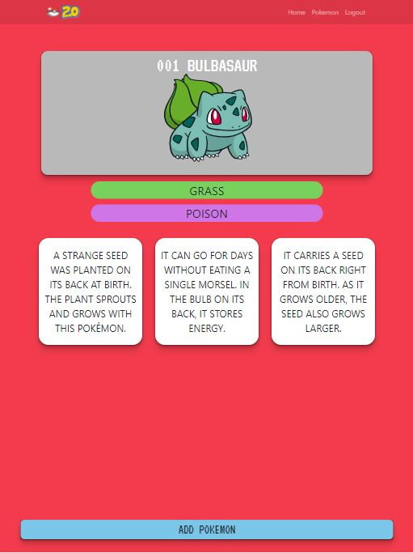
 
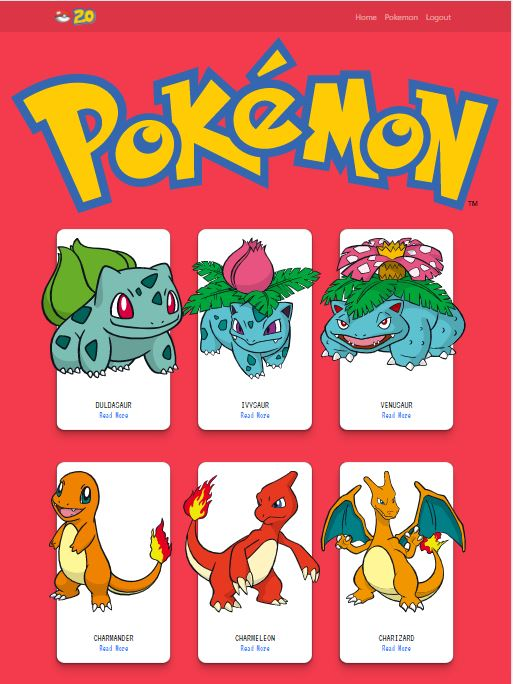
 
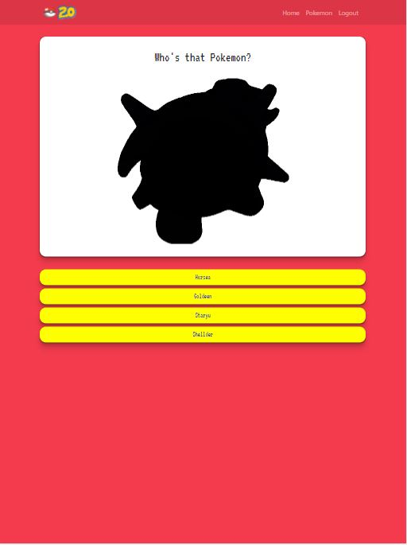

### Desktop
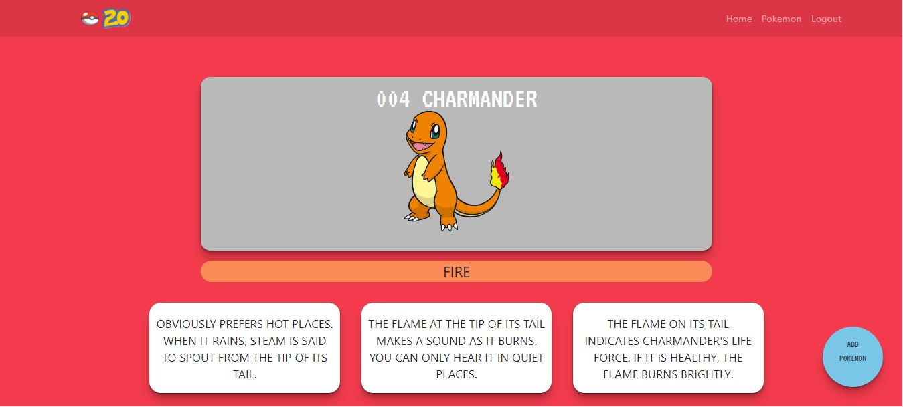
 
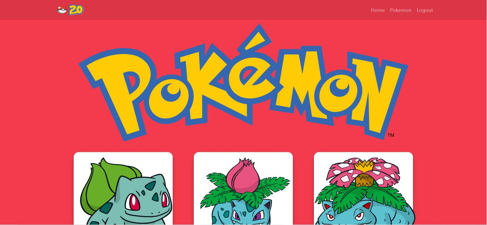
 
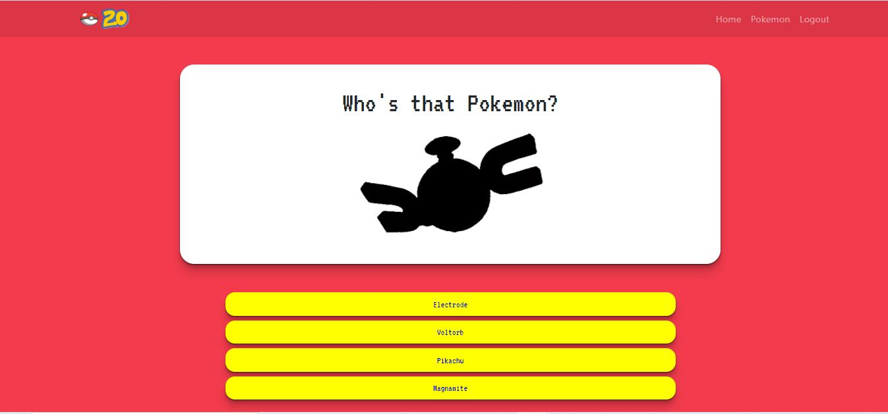
 
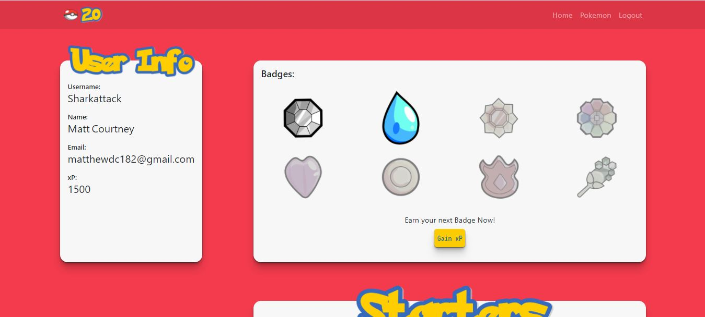
 

